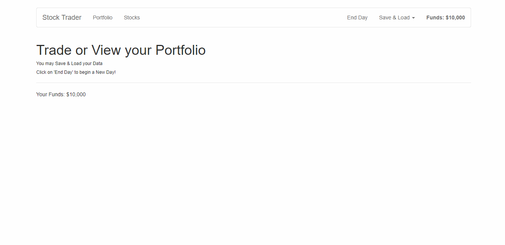

# WEB 2630 Stock Trader
> You will be creating a Stock Trader application using all of the skills you've learned throughout the semester. You will have a header that lets the user view their portfolio of stocks they have purchased. They will be able to go to stocks to buy stocks and see their prices. The End Day option will update the stock prices. There will be a Save & Load option that allows you to save and load the data from a firebase database using vue-resource and the header will display how much money the user has in the account. When the user buys stocks, the funds will be updated and the stocks purchased will show up under portfolio. You will be using Vue routing, Vue resource, and Vuex in this project. 

## Project Requirements
1. Create a Firebase Database
  * Set Database Rules
    * Set read and write to "true"
  * Get Database URL
2. Follow the ToDo Comments in GitHub Stock Trader Repo
  * Files with ToDo Comments
    * routes.js, main.js, App.vue
    * components (folder): Header.vue, Home.vue
    * portfolio (folder): Portfolio.vue, Stock.vue
    * stocks (folder): Stock.vue,Stocks.vue
    * store (folder): store.js, actions.js 
    * modules (folder)portfolio.js, stocks.js

## Part 1 Submission

1. Create WEB2630_StockTrader Repository on GitHub
    * Note: Make Repository Private
2. Open Terminal or Command Prompt
    1. Clone Template
        * git clone --bare https://github.com/CodySquadroni/WEB2630_StockTrader
            * Note: Make sure to 'cd' to a directory you want it downloaded to.
    2. cd Into WEB2630_StockTrader.git
    3. Copy Template Into Your Repository
        * git push --mirror https://github.com/GITHUB_USERNAME/WEB2630_StockTrader
            * Note: Make sure to put your GitHub Username in place of GITHUB_USERNAME
    4. Remove Copy WEB2630_StockTrader.git
    5. Clone Your GitHub Repository
        * git clone https://github.com/GITHUB_USERNAME/WEB2630_StockTrader
3. Start ToDo Comments and Project Requirements Above
4. Submit Your GitHub URL
  * For Part 1, you just need to have something submitted to show your progress. You will have more time to finish the project for Part 2.

## Part 2 Submission

1. Complete ToDo Comments and Project Requirements Above
2. Live Host Stock Trader on Netlify
3. Submit Your GitHub and Netlify URL

**Note: Remember to make your GitHub repository private and add me as a collaborator GitHub username: CodySquadroni**

## Final Outcome



# Commands

## Project setup
```
npm install
```

### Compiles and hot-reloads for development
```
npm run serve
```

### Compiles and minifies for production
```
npm run build
```

### Run your tests
```
npm run test
```

### Lints and fixes files
```
npm run lint
```

### Customize configuration
See [Configuration Reference](https://cli.vuejs.org/config/).
